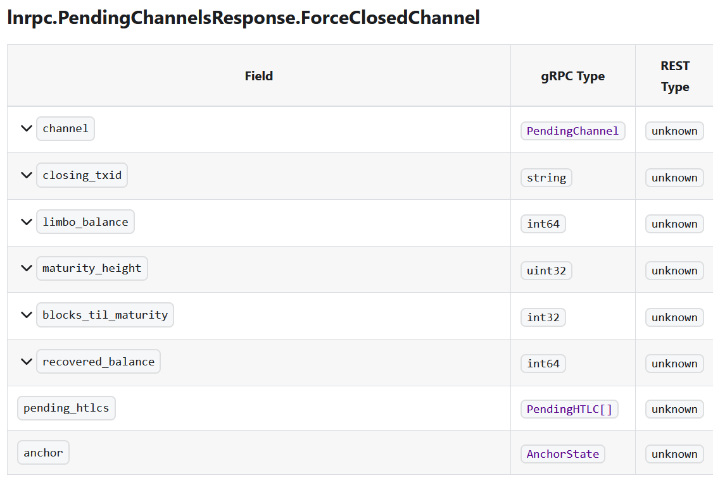

# Tutorial: Force Close steckengeblieben? -> Bump Fee

Ihr habt einen Channel den ihr (unglücklicher weise) force closen müsst (z.B. weil er
zu einer Node ist die seit ewigen Zeiten offline ist), und habt dabei eine zu niedrige
Fee ausgewählt, sodass der Channel Close ewig in "pending" feststeckt? Sind meine Funds / Sats jetzt verloren?

<p align=center>


</p>

## Keine Panik

> 👌 Hier werdet ihr lernen, wie ihr komplett in der Konsole mit einer sogenannten Child Pays For Parent (CPFP) Transaktion, die Fees für eure ursprüngliche Force Close Transkation erhöhen könnt (das s.g. Fee bumpen), sodass der Channel Close dann vollzogen werden kann.  
> **Wichtig:** das ganze wird euch mehr Sats und Zeit kosten und sollte nur im Notfall als ausweg benutzt werden. Die korrekte Reihenfolge sollte immer sein

$$
{Kooperativer.Close} > Force.Close (genügend Fees) > Force.Close (CPFP)
$$

## Übersicht

- Kurzanleitung Lösung "Stuck" Force Close (TL;DR)
- Anleitung Ausführlich
- Glosar zum Artikel
  - Force Close erklärt
  - Status der Transaktion
    - Definition "Limbo"
    - Ist meine Transaktion "stuck"
  - Lösung "stuck" Force Close
    - Definition Child-Pays-For-Parent (CPFP)

# Kurzanleitung Lösung "Stuck" Force Close

TL;DR

1. Channel Status und Channel Point identifizieren  
   `lncli pendingchannels`  
   Sucht nach dem Key `"channel_point":` der Wert bestelt aus eine zufällig wirkenden Zeichenkette (Hash) gefolgt von einem `:` und einer Zahl (output id). Eine bessere Erklärung des Channelpoints findet sich [hier](https://docs.lightning.engineering/community-resources/glossary#channel-point)
2. Initiieren einer CPFP

# Ausführliche Anleitung

## Status ermitteln

Als erstes schauen wir uns an welche "Pending" (ausstehdenden) Transaktionen (TX) zu Channels in unserem LND Client registriert sind: `lncli pendingchannels`. Als Ergebnis erhaltet ihr ein JSON (Key-Value Pairs) mit den folgenden Attributen


(_Details_ [_hier_](https://lightning.engineering/api-docs/api/lnd/lightning/pending-channels/index.html#lnrpcpendingchannelsresponseforceclosedchannel))

**TL;DR**

- [`lncli pendingchannels`](https://lightning.engineering/api-docs/api/lnd/lightning/pending-channels/index.html)
-

```sh
lncli pendingchannels

```


# Glosar zum Artikel

## Force Close

> **Definition** ⚙️ Im Lightning-Netzwerk bezeichnet ein **Force Close** den automatischen Abschluss einer Zahlungskanals, bei dem eine Partei den Kanal ohne Zustimmung der anderen Partei schließt. Dies passiert, wenn eine Partei eine Challenge-Periode auslöst, während der die anderen Parteien ihre letzten Transaktionsdaten einreichen können, um sicherzustellen, dass keine betrügerischen Änderungen am Kanalverlauf vorgenommen werden. Der Force Close ist in der Regel eine Notfallmaßnahme, wenn es zu Streitigkeiten oder technischen Problemen kommt.
(ChatGPT)

### Unterschiede zwischen Kooperativem Close und Force Close

| **Attribut**               | **Kooperativer Close**                              | **Force Close**                                          |
|----------------------------|-----------------------------------------------------|----------------------------------------------------------|
| **Dauer**                   | Schnell, abhängig von der Bestätigung der On-Chain-Transaktion (wenige Minuten bis Stunden) | Dauert min. 2016 Blöcke  (~2 Wochen). Grund Limbo Phase[$^{[1]}$](#definition-limbo) oder auch Timeout-Periode               |
| **Kosten**                  | Niedrig, da nur eine einfache On-Chain-Transaktion benötigt wird | Höher, da neben der Haupttransaktion zusätzliche Sicherungs- und Timeout-Transaktionen entstehen |
| **Beteiligung der Parteien** | Beide Parteien stimmen dem Schließen zu             | Nur eine Partei initiiert das Schließen einseitig         |
| **Sicherheit**              | Höhere Sicherheit, da beide Parteien einverstanden sind | Geringere Sicherheit für die gegnerische Partei, da sie Zeit hat, um zu reagieren und ihre Mittel zu sichern |
| **Komplexität**             | Einfach, ohne komplexe Mechanismen                  | Komplexer, da ein Timeout und spezielle Mechanismen erforderlich sind |
| **Risiko von Betrug**       | Sehr gering, da beide Parteien einverstanden sind   | Höheres Risiko, wenn eine Partei die Netzwerkregeln umgehen möchte |
| **Verfügbarkeit der Gelder**| Sofort nach Bestätigung verfügbar                   | Gelder sind nach der Timeout-Periode verfügbar             |

**Grund für höhere Kosten beim Force Close:**  
Beim **Force Close** sind mehr On-Chain-Transaktionen notwendig. Die Partei, die den Force Close initiiert, muss nicht nur die Closing-Transaktion bezahlen, sondern es können auch zusätzliche Transaktionen anfallen, wie z. B. Sicherheits- und Timeout-Transaktionen, um die korrekte Auszahlung zu gewährleisten und Manipulationsversuche zu verhindern. Dies führt zu höheren Netzwerkgebühren.

## Status Channelclose Transaktion

### Definition Limbo

Im Lightning Network-Kontext beschreibt "limbo" (wörtlich „Schwebezustand“) den Zustand, in dem eine Transaktion nach einem Force Close vorübergehend festhängt oder auf eine Bestätigung wartet. Dieser Zustand tritt auf, weil beim Force Close eine gewisse Zeit vergehen muss, bevor die endgültige Auszahlung der Gelder erfolgen kann. Dies ist Teil des Sicherheitsmechanismus, um Betrug zu verhindern.

"Limbo" bedeutet in diesem Zusammenhang:

    Die Mittel sind technisch gesehen in einem Schließprozess, aber sie sind vorübergehend unzugänglich.
    Die Transaktion muss eine Timeout-Periode (z. B. 2016 Blöcke oder etwa zwei Wochen) abwarten, bevor die Mittel freigegeben werden.
    Es gibt Unsicherheiten darüber, wann genau die Transaktion abgeschlossen wird, da es von der Bestätigungszeit im Bitcoin-Netzwerk abhängt.

### Transaktion steckengeblieben / "stuck"

Unabhängig vom "Limbo" bzw. Timeout-Periode kann eine Transaktion steckenbleiben. Dies geschieht wenn die gewählte Feerate zu niedrig ist und somit von Minern nicht mit einen Block aufgenommen wird.

## Lösung

### Child-Pays-For-Parent (CPFP)
>
> Author Definition CPFP: ChatGPT

Eine **Child-Pays-For-Parent (CPFP)**-Transaktion ist eine Technik im Bitcoin-Netzwerk, die verwendet wird, um eine feststeckende oder unbestätigte Transaktion durch eine nachfolgende Transaktion zu beschleunigen. Es ermöglicht einem Nutzer, eine neue (nachfolgende) Transaktion zu senden, die eine zu niedrige Gebühr der ursprünglichen (Eltern-)Transaktion durch eine höhere Gebühr ausgleicht. Dies geschieht, indem die neue Transaktion auf den unbestätigten Outputs der ursprünglichen Transaktion aufbaut.

#### Funktionsweise von CPFP

1. **Elterntransaktion (Parent)**: Dies ist die ursprüngliche Transaktion, die noch unbestätigt ist, normalerweise weil die Gebühr zu niedrig angesetzt wurde, um Miner zu motivieren, sie schnell in einen Block aufzunehmen.

2. **Kindtransaktion (Child)**: Dies ist eine neue Transaktion, die einen der unbestätigten Outputs der Elterntransaktion verwendet. Die Kindtransaktion enthält jedoch eine deutlich höhere Gebühr.

3. **Miner-Präferenz**: Miner betrachten **Transaktionsfamilien** (Eltern-Kind-Beziehungen) als eine Einheit. Sie berücksichtigen die **kombinierten Gebühren** beider Transaktionen und maximieren ihren Gesamtgewinn. Selbst wenn die Elterntransaktion eine zu niedrige Gebühr hat, wird sie durch die hohe Gebühr der Kindtransaktion für Miner attraktiver, da sie zusammen ein lohnendes Gebührenniveau erreichen.

#### Beispiel

- Du sendest eine Transaktion (Eltern) mit niedriger Gebühr, die im Mempool hängen bleibt und nicht von den Minern verarbeitet wird.
- Um die Bestätigung zu beschleunigen, erstellst du eine zweite Transaktion (Kind), die eine der Ausgaben (Outputs) der Elterntransaktion verwendet. In dieser Kindtransaktion setzt du eine höhere Gebühr an.
- Miner sehen die kombinierte Gebühr der Eltern-Kind-Transaktionen und entscheiden sich, beide Transaktionen gemeinsam zu verarbeiten, um die höhere Gesamtgebühr zu erhalten.

#### Warum CPFP nutzen?

- **Gebührenanpassung nachträglich**: Wenn du versehentlich eine zu niedrige Gebühr gewählt hast und die Transaktion im Mempool hängen bleibt, kannst du sie durch CPFP „retten“.
- **Keine Kontrolle über Elterntransaktion**: Wenn du der Empfänger einer Transaktion bist und diese aufgrund zu niedriger Gebühren hängen bleibt, kannst du mit CPFP deine eigene Kindtransaktion erstellen, um die Elterntransaktion zu beschleunigen.

#### Voraussetzungen

- Die Elterntransaktion muss unbestätigt sein und einen Output haben, der von der Kindtransaktion verwendet werden kann.
- Die Kindtransaktion muss eine ausreichend hohe Gebühr haben, um die kombinierte Gebühr für beide Transaktionen attraktiv genug für die Miner zu machen.

**Zusammengefasst:** CPFP ist eine Methode, um eine unbestätigte Transaktion im Bitcoin-Netzwerk durch das Erstellen einer nachfolgenden Transaktion mit höheren Gebühren zu beschleunigen, sodass Miner die ursprüngliche (Parent-)Transaktion zusammen mit der neuen (Child-)Transaktion bestätigen.

