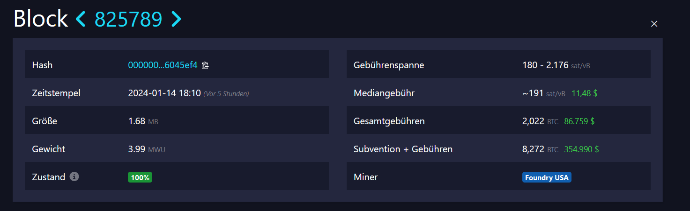
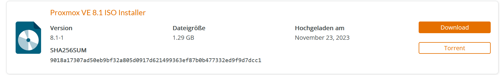

# RaspiBlitz im Doppelpack - RAID-1 für maximale Sicherheit beim Betrieb deiner Lightning⚡ Fullnode

In diesem Blog Beitrag bekommt ihr eine Schritt für Schritt Anleitung wie ihr die Sicherheit beim Betrieb einer RaspiBlitz weiter maximieren könnt indem ihr RAID-1 für euren RaspiBlitz aufsetzet. Dieser Blog ist von Plebs für Plebs geschrieben und basiert auf unseren Erfahrunge

## Zielbild RaspiBlitz mit RAID-1

1. Dazu werden wir auf einem Stromsparenden Mini PC einen Virtualisierungsserver (Proxmox) aufsetzen.
2. Einen RAID-1 (also absoluten Spiegel) für unsere SSD aufsetzen.  
Damit erzeugen wir Redundanz, was im Endeffekt bedeutet, selbst im Wort Case: das uns eine SSD abraucht, läuft unser RaspiBlitz ganz unbeindruckt weiter.
3. Erstellen einer Virtuellen Machine (erzeugt via Proxmox) auf der unser Raspiblitz läuft.
4. (Optional) Migrieren unserer bestehenden Node

Klingt technisch oder zu kompliziert 🫢?  
Ist es überhaupt nicht und wir nehmen dich mit auf die Reise und liefern hier ein Schritt für Schritt Tutorial.

### Warum? Oder was sind die Vorteile von RAID-1 💾?

Beim Ausfall einer SSD gibt es eine komplette Redundanz. Eure Channels bleiben also selbst beim  Totalausfall einer SSD offen. Bei den aktuellen hohen Transaktionsgebühren (TX, ~ 180 sats/VByte), spart ihr euch somit eine Menge Sats (₿), zudem ist es einfach ein sehr beruhigendes Gefühl, zu wissen dass die Platte mit euren Funds komplett gespiegelt und somit abgesichert ist.

**Exemplarischer aktueller Block**  🔎

Einen Channel zu Öffnen kostet bei den Momentanen Fees gerne mal zwischen 15.000 und 30.000 SATs. Ein stolzes Sümmchen was zum Zeitpunkt des schreibens in etwa ~5.72€ - 11.44€ entspricht.
  


## Danger Zone ⚠️ - Gefahren & Risiken

Solltet ihr eine **neue Node** aufsetzen, ist der gesamte **Prozess völlig unbedenklich**. Entwas anders sieht das ganze jedoch aus wenn ihr eine bestehende Node migrieren wollt.  

Ok, Full Disclosure, der Prozess von einem Standard Setup (RaspiBlitz auf einem Raspberry 4 oder 5) auf ein Setup umzustellen, dass RAID-1 erlaubt ist nicht trivial und birgt Risiken. Im Sinne maximaler Transparenz und damit ihr die richtige Entscheidung für euchtreffen könnt sind hier einige Gefahren aufgelistet.

Das größte Risiko besteht darin, dass ihr ein Backup eurer LND Channels erstellt (am Ende des Prozesses fährt euer Raspiblitz runter) und es geht in diesem Moment noch ein HLTC (LN Transaktion durch). Nach dem Wiederherstellen eures Migrations File würde dass dazu führen, dass ihr mit dem Backup einen alten Channel Status Broadcastet und somit Gefahr für eine Justice / Penalty Transaktion lauft.

> ℹ️ **Info - Was ist das Risiko?**  
> Eine LN Zahlung geht beim erstellen des Backups durch und führt beim wiederherstellen des Backups zu einer Justice / Penalty Transaktion für diesen einen Channel kommt. Das würde den komplett Verlust aller Funds in diesem einen Channel bedeuten

**Additional Reads and Sources:**

- <https://docs.lightning.engineering/lightning-network-tools/lnd/migrating-lnd>
- <https://blog.bitmex.com/lightning-network-justice/>
- <https://voltage.cloud/blog/lightning-network-faq/penalty-transactions-on-lightning-network/>

### Vorbereitung / Mitigation

Ihr solltet unbedingt sicher gehen, dass ihr

1. Den Seed zu eurer Node habt
2. Ein aktuelles [SCB](https://docs.lightning.engineering/lightning-network-tools/lnd/recovery-planning-for-failure#static-channel-backups-scb) (Static Channel Backup) habt

Habt. Damit ihr im worst-case Szenario mit dem Desaster Recover ([Link](https://docs.lightning.engineering/lightning-network-tools/lnd/disaster-recovery)) eure Funds wieder herstellen könnt.

## Hardware Setup

### Getestet für diesen Blog

Funktion | Setup 1 (bvolution) | Setup 2 (to be annouced)
---------|----------|---------
 Host System (Proxmox) | - HP EliteDesk 800 G3 mini 35W, Desktop-Mini, Core i5 7500T 2,7GHz, 16GB RAM, 512GB SSD <br> ([Link](https://www.computeroutlet24.de/pc-systeme/hp-elitedesk-800-g3-mini-35w-desktop-mini-core-i5-7500t-27ghz-16gb-ram-512gb-ssd-windows-10-pro.html?cache=1705252819)), **179€**) | -
 Speicher für Raid | - 2 x SanDisk 1TB SSD Plus ([Link](https://www.idealo.de/preisvergleich/OffersOfProduct/201902833_-ssd-plus-1tb-sdssda-1t00-g27-sandisk.html), **~60€**),<br> - angeschlossen über 2 x UGREEN SATA-III zu USB3.0 Adapter ([Link](https://www.amazon.de/dp/B06XWSDGP6?psc=1&ref=ppx_yo2ov_dt_b_product_details), 14€) | -
 USB Stick / SD Karte zum installieren von Proxmox | Beliebiger USB Stick oder SD Karte | -

<hr>

# Schritte

1. Proxmox (Virtualisierungs Host System)
2. ZFS RAID-1 Setup: SSD wird komplett gespiegelt
3. Virtuelle Machine (RaspiBlitz)
4. (Migration einer bestehenden Node)

Ok auf gehts

## 1) Proxmox VE Installieren

Die .iso Datei zur Installation von Proxmox kannst du [hier](https://www.proxmox.com/de/downloads) runterladen.
Wir wählen hier **Proxmox VE**



> ℹ️ **Info:**  
> Was ist Promox VE? Proxmox Virtual Environment (Proxmox VE) ist eine Open-Source-Plattform für Virtualisierung, die auf dem Kernel-basierten Virtual Machine (KVM) Hypervisor und dem containerbasierten Virtualisierungssystem LXC basiert. Sie bietet eine integrierte Management-Oberfläche für die Bereitstellung und Verwaltung von virtuellen Maschinen und Containern auf einem einzigen Host.

**Wichtig:** Wenn ihr auf sicher gehen wollt, dass die Datei nicht manipuliert ist und identisch zu der auf der Homepage von Proxmox angegebenen datei ist, könnt ihr den SHA256 Hash der Datei abgleichen. Und gerade wenn es um eure hart verdienten Sats geht, lohnt es sich ggf. extra vorsichtig zu sein, oder 🤔?

Falls euch das nicht wichtig ist, könnt ihr getrost das nächste Unterkapitel überspringen

### Installtionsdatei Verifizieren

#### Windows 🪟

- Dazu öffnest eine Konsole
  - Tipp: <kbd>Win</kbd> + <kbd>R</kbd> dort `cmd` eingeben <kbd>Enter</kbd>
- Wechsel in den Ordner in den Du die Datei runter geladen hast mittels `cd`
  - In der Regel wirst du die Datei vermutlich im Download Ordner runterladen.  
  `cd C:/Users/<benutzer>/Downloads`  
  Tausche hier < benutzer > gegen deinen Benutzernamen aus
- Mittels dem bei Windows standardmäßig gelieferten certutil bekommst du den Hash
  - ```sh certutil -hashfile "<dateiname>" SHA256```
  - In meinem Fall wäre diese der folgende Befehl (wenn du in der Zukunft eine neue Version runterlädst kann sich natürlich der Dateiname und natürlich auch der Zielhash ändern)
  - ```sh certutil -hashfile proxmox-ve_8.1-1.iso SHA256```
- Das Ergebnis (der Hash) gleichst du dann mit dem auf der Webseite angegeben Hash ab

```sh
SHA256-Hash von proxmox-ve_8.1-1.iso:
9018a17307ad50eb9bf32a805d0917d621499363ef87b0b477332ed9f9d7dcc1
CertUtil: -hashfile-Befehl wurde erfolgreich ausgeführt.
```

Hier seht ihr das der Hash aus der Konsole übereinstimmt mit dem von der Webseite

### Vorbereiten der Installtion (Flash der .iso Datei)

Wenn Ihr bereits einen RaspiBlitz im Betrieb habt, sollte euch das folgende sehr bekannt vorkommen.
Die Schritte sind quasi identisch zum Setup für den Raspiblitz ([Write the SD Card image to the SD Card](https://github.com/raspiblitz/raspiblitz#write-the-sd-card-image-to-your-sd-card)).
Für alle die bisher noch nie ein anderes Betriebssystem installiert haben, ... ist hier die Definitiv nicht mit ChatGPT (😆) generierte, Begründung, warum
wir die nächsten Schritte begehen.

> ℹ️ **Info:**  
> Das Schreiben eines ISO-Abbilds auf einen USB-Stick ermöglicht es, ein bootfähiges Installationsmedium zu erstellen, das tragbar, schnell, wiederverwendbar und flexibel ist, was die Installation von Betriebssystemen auf verschiedenen Computern erleichtert.

Um ein solches "Bootfähiges Installationsmedium" zu erstellen, empfehle ich unter Windows Balena Etcher. Das Tool ist einfach super intuitiv und selbst erklärend.
Das ganze dauert dann eine kleine Weile

<p align=center>

</p>

Den USB-Stick bzw. die SD-Karte stöpselt ihr jetzt einfach in euren Mini-PC und folgt den Installationsschritten ...

Die Installation ist ziemlich selbt erklärend und es gibt diverse Blogs[$^{[1]}$][https://decatec.de/home-server/proxmox-ve-installation-und-grundkonfiguration/]($^{[2)}$](<https://mwiza.medium.com/how-to-install-proxmox-ve-on-a-server-771c9f99933a>)

### Erste Schritte 👣 in Proxmox

Hier sind einige erste Schritte die ich nach dem Setup von Proxmox empfehlen kann

- Macht euch mit der GUI / Webinterface vertraut
  - Dazu gebt ihr im Browser eurer wahl folgendes ein `192.168.178.100:8006`
  - Bedenkt das durch die IP Adresse eures Proxmox Mini-PC zu ersetzen
  - Achtet auf den Port am Ende (8006)
- Loggt euch über SSH auf eurem Proxmox ein
  - Startet ein Terminal (s.o.)
  - `ssh root@192.168.178.100`
  - Auch hier müsst ihr natürlich die IP entsprechend austauschen

> **Info**  
> Ihr könnt die IP von eurem neuen Proxmox Mini-PC über euren Router herausfinden. Dazu loggt ihr euch über den Browser in euren Router ein und lasst euch das Lokale Netz anzeigen.

- Updated die System Packages und installiert was ihr braucht
  - Ich mag meine Bash Konsole gerne in Farbe
  - Außerdem entwickle ich gerne ich in Neovim
  - Und git braucht man eigentlich immer
  - Hier ist ein Micro Repository, mit den Dingen die ich gerne auf einem neuen Proxmox Sytem aufsetze: [`customize-proxmox`](https://github.com/bvolution/customize-proxmox)

## 2) ZFS RAID-1 in Proxmox aufsetzen

Was ist jetzt ein ZFS RAID-1? Zunächst einmal ist ZFS ein Dateisystem (Zettabyte File System) und RAID-1 steht für "Redundant Array of Independent Disks (Redundanter Array unabhängiger Festplatten)" [$^{[3]}$](https://www.westerndigital.com/de-de/solutions/raid) und bedeutet dass der Inhalt denn ihr normalerweise nur eine Platte schreibt permanent gespiegelt und auf eine zweite Platte zusätzliche geschrieben werden.
Das ZFS (Zettabyte File System) ist  für seine Robustheit und Datensicherheit bekannt, auch im Falle von Stromausfällen. Es wurde speziell entwickelt, um hohe Datenintegrität und Fehlertoleranz zu bieten.

> ℹ️ **Info:**  
> Ein ZFS RAID-1, auch als Spiegelung bekannt, beinhaltet das Kopieren von Daten auf zwei Festplatten (oder mehr) in Echtzeit. Alle Schreibvorgänge werden auf beide Platten dupliziert, was Redundanz und erhöhte Datensicherheit bietet, da auf die Daten zugegriffen werden kann, selbst wenn eine der Platten ausfällt.

### Schritte

1. Versichert euch mit list block (`lsblk`) das eure Platten auffindbar sind. In meinem Fall sind sie zu finden unter `/dev/sdb` und `/dev/sdc`

<p align=center>

</p>

2. Für die beste Performance empfiehlt es sich zunächst einen GPT (= GUID Partitions Tabelle[$^{[4]}$](https://de.wikipedia.org/wiki/GUID_Partition_Table), ausnahmsweise mal nicht die KI 😆) auf die beiden neuen Platten mittels gdisk[$^{[5]}$](https://wiki.ubuntuusers.de/gdisk/#Aufbau-einer-GPT) zu schreiben  zu schreiben
   1. `gdisk /dev/sdb`
      1. Wichtig für beide Platten und, sdb oder sdc entsprechend durch eure device Buchstaben ersetzen.
   2. Dann eingeben `"gpt"` -> <kbd>O</kbd> -> <kbd>Y</kbd>
   3. Dann noch schreiben auf die PLatte mittels <kbd>W</kbd> -> <kbd>Y</kbd>
   4. Rinse and Repeat (Also erneut für die zweite Platte)

2. Als Tipp: Holt euch die UUID (Universally Unique Identifier) eurer Platten und notiert diese gemeinsam mit dem /dev/sdX (z.B. `/dev/sdb`) auf einem Aufkleber direkt auf eurer Platte. Die UUID bekommt ihr raus über `blkid /dev/sdb`

für die beste performance aber noch die ssds mit gdisk auf gpt partitionieren

- dann o (gpt schreiben)
- dann w
- macht die änderungn wirksam

```sh
zpool create -o ashift=12 <mirrorname> mirror /dev/disk/by-id/UUID-angeben /dev/disk/by-id/UUID-angeben
```

## Nächste Sicherheitsausbaustufen

Wir nähern uns hier mit dem RAID-1 Betrieb einer extrem hohen Ausfallsicherheit. Ein letztes Risiko bleibt der Stromausfall / Blackout. Im worst case, geht hier dein komplettes Setup in die Knie, mitten im Schreibprozess auf den RAID-1 (die beiden SSDs). Durch die Art und Weise wie RAID-1 und ZFS funktioniert ist die gefahr von data corruption ist etwas höher bei ZFS

### USV / UPS als Lösung

Um auch im Falle des gefüchteten Blackouts best möglich geschützt zu sein (und im übrigen auch gegen gelgentliche vorkommende Schwankungen im Netz), empfiehlt es sich als eine weitere Sicherhehits-Ausbaustufe über eine USV (**U**nunterbrechbare **S**trom**v**ersorgung) nachzudenken. Mehr dazu in unserem nächsten Blog Beitrag.
